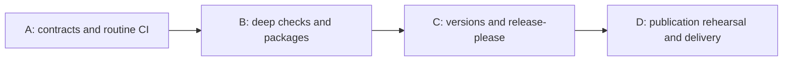

# GitHub workflows execution script

**Four serial threads take the fork from its current workflows to a verified
GitHub release. Phase A is approved; later phases await their entry gates.**

Status: **Phase A approved and active, 2026-10-10**. Read the [plan](GITHUB_WORKFLOWS_PLAN.md) for
decisions and the [roadmap](GITHUB_WORKFLOWS_ROADMAP.md) for step proofs. This
script adds thread boundaries, dependencies and literal starting prompts.

## Rules and order

Each thread runs `keep-me-in-the-loop` with a continuous reviewer and roughly
2–4 chunks. At its opening, approve the concrete phase scope, live operations
and interventions once. Plan confirmation does not approve implementation.
Keep the existing checkout by default; these threads are serial because they
share package configuration, version contracts, workflow routing and docs.
Do not create parallel worktrees unless the user requests them. If parallelism
is later requested, isolate sibling worktrees, reconcile current upstream before
push, and merge shared-document ticks without overwriting another thread.



This is the critical path; no independent thread is presently scheduled.
Thread A runs in the requested sibling worktree on `ci/github-workflows`;
B/C/D wait on their predecessors and phase approval. Current implementation
and evidence are in [project status](GITHUB_WORKFLOWS_STATUS.md). Refresh Git and
live state before each phase. Preserve unrelated edits, installed state,
signing identities and published releases.

Create one project status document at A using `maintain-project-status`, pointing
its next-action field at this script. Record evidence inline, tick roadmap and
plan together, and mark completed threads here. Freeze the accepted latency
baseline and enforce zero-spend throughout. Never restart the user's main daemon
or modify their installations without explicit authorization.

## A. Establish contracts and shared routine CI — steps 1–3

**State:** approved; A1 / G0 complete, A2 next, G1 pending.

```text
Use $keep-me-in-the-loop to run thread A in docs/GITHUB_WORKFLOWS_SCRIPT.md.
Read its rules, plan, roadmap steps 1–3 and current state. Propose bounded chunks
with the reviewer before execution. Mark A done with its proofs and record any
deviation that changes later threads.
```

- **Depends on:** none; not alongside B/C/D because they require A's contracts
  and share the active checkout.
- **Chunks:** (1) feasibility/semver/Android-encoding/native-proof and zero-cost
  contracts; (2) shared routine CI and measured baseline; (3) rebase reuse and
  upstream-sync regression proof.
- **Human:** at approval authorize bounded probes and test workflow changes;
  before affected probes supply inaccessible billing/access evidence; initial
  0.1.0 and clean-break manual migration are selected; after S2 accept numeric latency
  ceiling. Pause only dependent work while these decisions wait.
- **Live:** standard free runners only after storage/no-overage checks. One
  representative attempt per unresolved native lane and one cold/warm routine
  pair, then analyze. No release or production rebase publication.
- **Done when:** G0/G1 pass. Native feasibility blockers are resolved or brought
  back for explicit scope revision; they are not silently deferred into B.

## B. Verify journeys and every package — steps 4–6

**State:** provisional; waits on A.

```text
Use $keep-me-in-the-loop to run thread B in docs/GITHUB_WORKFLOWS_SCRIPT.md.
Read its rules and roadmap steps 4–6; use A's accepted candidate and budget
contracts. Mark B done only after G2/G3 proofs, and record deviations affecting C/D.
```

- **Depends on:** after A, which provides candidate identity, native feasibility,
  routine CI and free-only transport. Not alongside C/D: shared packaging and
  release interfaces must be accepted first.
- **Chunks:** (1) deep journeys and safe-test-PR routing; (2) Mac/Android package
  preservation; (3) Linux x64/ARM64 formats; (4) Windows x64/ARM64 NSIS.
- **Human:** before signing, provision any missing existing free key access;
  at approval settle explicit device-test authority/presence if A found it
  unavoidable. Never substitute an emulator's different ABI without disclosure.
  Otherwise none after approval unless a feasibility assumption fails.
- **Live:** native standard runners, one candidate matrix; disposable installation
  state, no public releases. Existing personal devices only if explicitly approved.
- **Done when:** G2/G3 pass, including every format/architecture, disposable-state
  upgrades, signatures and true shipped-ABI evidence. Real bot-PR routing is C;
  actual installed legacy-client migration remains D.

## C. Prepare compatible releases with release-please — steps 7–8

**State:** provisional; waits on B.

```text
Use $keep-me-in-the-loop to run thread C in docs/GITHUB_WORKFLOWS_SCRIPT.md.
Read its rules and roadmap steps 7–8. Implement the settled independent-version
and updater migration contract, then verify real release-please PR events.
Keep releases unpublished. Mark C done with G4 evidence and record deviations.
```

- **Depends on:** after B, which supplies verified package candidates; A's
  selected initial version and compatibility contract remain authoritative.
  Not alongside D: candidate/version and bot-event behavior must be accepted.
- **Chunks:** (1) version/updater transition; (2) release-please configuration and
  guarded event routing; (3) actual bot PR/update and merge-identity rehearsal.
- **Human:** before live tests, install/provide scoped bot access if unavailable
  and any necessary repository permissions. At approval authorize the bounded
  test PR/draft activity. No publisher certificates required; no real release.
- **Live:** one controlled bot-PR lifecycle with bounded free evidence. Preserve
  installed clients and public release history. Reconcile only campaign-owned
  test PRs/drafts after verification.
- **Done when:** G4 passes; bot PR really triggers routine/deep checks, fork
  semver and manual-migration fixture proofs hold, no premature public release.

## D. Enforce and demonstrate complete release delivery — steps 9–11

**State:** provisional; waits on C.

```text
Use $keep-me-in-the-loop to run thread D in docs/GITHUB_WORKFLOWS_SCRIPT.md.
Read its rules and roadmap steps 9–11. Propose coordinator, failure rehearsal,
and first-delivery chunks; identify publication/device authority explicitly.
Mark D done only after G5/G6 and record the user's final acceptance.
```

- **Depends on:** after C, with A/B proofs still valid for the interfaces used.
  No concurrent campaign thread edits the candidate or publication machinery.
- **Chunks:** (1) exact-SHA coordinator and old-trigger cutover; (2) failure/retry
  and all-green draft rehearsal; (3) explicitly approved first publication,
  actual installed-client migration/recovery and operational handoff.
- **Human:** at approval define publication authority and device-test boundary.
  If the candidate cannot be selected then, pause publication after G5 for its
  selection; independent docs/checks continue. At device-test point the user
  approves updates/restarts and participates as needed. After proof, user accepts
  G6; do not claim campaign closure before that acceptance.
- **Live:** one exact candidate on standard runners, bounded draft-only failures,
  then the selected GH release. Never alter published immutable assets. Keep
  rollback/recovery assets and installed data; clean only owned abandoned drafts.
- **Done when:** G5/G6 pass and operational docs explain retries, rebase history,
  updates, zero-cost controls and stable latency checks. No unresolved required
  platform proof or implicit paid dependency remains.

## When a human is needed

No calendar appointments are assumed. Each thread starts with phase approval.
A additionally needs measured-budget agreement; initial 0.1.0 is selected;
B/C may need free signing/bot access; D needs first-publication selection,
personal-device presence and final acceptance. Move access work before thread
start wherever possible. An unresolved item blocks its dependent action only.

## Deferred and revision log

Windows/AppImage automatic updates are stretch after G6 and separate approval.
Paid publisher verification, iOS/Intel Mac, extra package formats and paid provider
tests remain excluded. No required roadmap step is outside these four threads.

- 2026-10-10, execution amendment: Phase A approved in the requested sibling
  worktree with performance and 10 GB cache constraints. Initial fork version
  selected as 0.1.0, semver-only upgrade ordering, clean break/manual migration;
  this supersedes the earlier numeric sequence and legacy-bridge proposal.

- 2026-10-10: the user confirmed all three tiers for commit and push. Thread A
  is ready for phase approval; implementation remains unapproved.

- 2026-10-10: drafted four serial threads around settled single-dev decisions;
  G2 uses a safe test PR to avoid depending on C's release-please setup. All
  thread internals after feasibility remain provisional.
